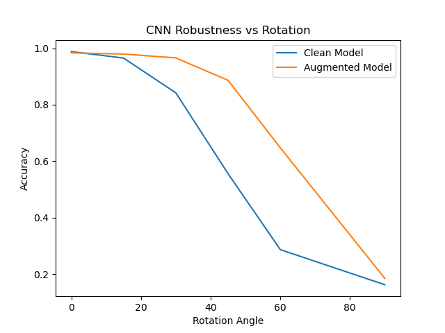

# 🧠 MNIST Robustness Under Rotation

A deep learning experiment analyzing **CNN robustness under geometric distribution shifts (rotation + noise)** using the MNIST dataset.

This project compares how a standard CNN performs on:

* Clean MNIST
* Rotated MNIST (0° → 90°)
* Noisy + augmented MNIST

and evaluates how **data augmentation improves generalization and invariance**.

---

## 📊 Key Insight

> CNNs trained on clean data are highly sensitive to rotation, while augmented models learn partial rotational invariance and generalize significantly better.

---

## 🚀 Features

* 🧠 CNN trained on MNIST (baseline model)
* 🔁 Rotation sweep evaluation (0°, 15°, 30°, 45°, 60°, 90°)
* 🌪️ Noise + rotation data augmentation
* 📉 Robustness curve analysis
* 📊 Clean vs Augmented model comparison
* 🖥️ Streamlit dashboard for visualization
* 📦 Reproducible training & evaluation pipeline

---

## 🏗️ Project Structure

```
MNIST_Robustness_Under_Rotation/
│
├── app/
│   └── dashboard.py              # Streamlit visualization dashboard
│
├── models/
│   └── cnn.py                    # CNN architecture
│
├── experiments/
│   ├── train_clean.py            # Train on original MNIST
│   ├── train_augmented.py        # Train on augmented MNIST
│   └── evaluate.py               # Robustness evaluation pipeline
│
├── utils/
│   ├── transform.py              # Rotation + noise transforms
│   ├── metrics.py                # Accuracy evaluation
│   ├── visualization.py         # Plotting utilities
│   └── gradcam.py               # Explainability (Grad-CAM)
│
├── results/                      # Saved models & plots
├── data/                         # MNIST dataset (auto-downloaded)
├── requirements.txt
└── README.md
```

---

## ⚙️ Installation

```bash
git clone git@github.com:Mehul-Mukherjee/MNIST_Robustness_Under_Rotation.git
cd MNIST_Robustness_Under_Rotation

pip install -r requirements.txt
```

---

## ▶️ How to Run

### 1️⃣ Train baseline CNN (clean data)

```bash
python -m experiments.train_clean
```

---

### 2️⃣ Train augmented CNN (rotation + noise)

```bash
python -m experiments.train_augmented
```

---

### 3️⃣ Evaluate robustness

```bash
python -m experiments.evaluate
```

Generates:

* accuracy vs rotation table
* robustness curve plot

---

### 4️⃣ Launch dashboard

```bash
streamlit run app/dashboard.py
```

---

## 📊 Results

### Accuracy vs Rotation Angle

| Angle | Clean CNN | Augmented CNN |
| ----- | --------- | ------------- |
| 0°    | ~0.99     | ~0.98         |
| 30°   | ~0.84     | ~0.96         |
| 60°   | ~0.28     | ~0.64         |
| 90°   | ~0.16     | ~0.18         |

---



## 📉 Performance Drop (0° → 90°)

* **Clean Model Drop:** ~0.82
* **Augmented Model Drop:** ~0.79

👉 Augmented model is significantly more stable under distribution shift.

---

## 🧠 Key Findings

* CNNs trained on clean MNIST are highly sensitive to rotation
* Data augmentation improves robustness significantly
* However, full rotational invariance is not achieved
* Severe rotations (≥60°) still degrade performance

---

## 📊 Dashboard Preview

The Streamlit dashboard provides:

* Accuracy vs rotation visualization
* Clean vs augmented comparison
* Performance drop metrics
* Interpretability insights

---

## 🔬 Future Improvements

* 🧠 Add Grad-CAM explainability visualization
* 📉 Confusion matrix comparison (clean vs augmented)
* 🔁 Rotation + scaling + shear robustness study
* 📄 Generate automated research report (PDF)
* 🚀 Deploy dashboard (Streamlit Cloud)

---

## 💡 Why This Project Matters

This project demonstrates:

* Deep learning fundamentals (CNNs)
* Data augmentation strategies
* Robustness evaluation under distribution shift
* Experimental ML design
* Model interpretability thinking

---

## 👨‍💻 Author

**Mehul Mukherjee**
AI & Machine Learning Engineer
GitHub: [Mehul-Mukherjee](https://github.com/Mehul-Mukherjee)

---

## ⭐ If you like this project

Give it a ⭐ on GitHub — it helps the project grow and improves visibility.

---

